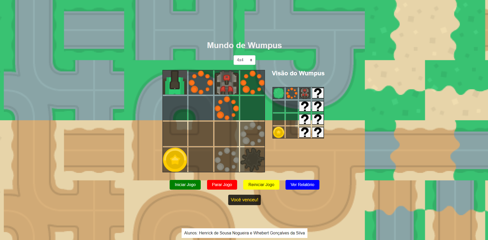

<div align="center">
   
</div>

# 🌍 Mundo de Wumpus

## Descrição

"Mundo de Wumpus" é um jogo clássico de inteligência artificial onde um agente navega por um tabuleiro para encontrar ouro enquanto evita poços e o perigoso Wumpus. O projeto explora conceitos de agentes fortes e fracos e aplica técnicas de aprendizado por reforço (Q-learning) para melhorar o desempenho do agente ao longo do tempo.

## Tecnologias Adotadas

-  **HTML5**: Estrutura da página e elementos do jogo.
-  **CSS3**: Estilização do jogo, incluindo layout, cores e imagens de fundo.
-  **JavaScript**: Lógica do jogo, incluindo a implementação do agente e algoritmos de aprendizado.

## Metodologia

### Funcionamento

**Selecionar Versão do Agente**

1. Versão 1: Na versão um o tabuleiro é gerado aleatoriamente, e o agente consegue presentir cheiro e vento e tentar identificar o wumpus.
2. Versão 2: Na versão 2 o agente o tabuleiro não é modificado e o agente consegue "memorizar" o tabuleiro ao inicio de cada rodada.

### Etapa 1

**Gerador Aleatório de Ambientes do Mundo de Wumpus:**

1. **Tamanho da Matriz:** A matriz do ambiente é definida pelo tamanho \( n \), onde \( n \geq 3 \). A matriz é quadrada, então ela terá \( n \) linhas e \( n \) colunas.
2. **Objetos:** Os objetos no ambiente incluem poços (p), o Wumpus (w) e o ouro (o). A quantidade desses objetos pode ser definida pelo usuário ou automaticamente, seguindo algumas regras com base no tamanho do ambiente.
3. **Posicionamento de Objetos:** Os objetos são posicionados aleatoriamente no ambiente, exceto na casa inicial (0,0), que deve permanecer vazia. Cada objeto gera percepções específicas que são colocadas nas casas adjacentes:
   - Poços geram brisas nas casas adjacentes.
   - O Wumpus gera cheiro nas casas adjacentes.
4. **Implementação no Código:**
   - A matriz do ambiente (`gameBoard`) é inicializada com todas as casas vazias.
   - As posições dos objetos (poços, Wumpus e ouro) são geradas de forma aleatória, garantindo que não haja objetos na posição inicial (0,0).
   - As percepções (brisas e cheiros) são adicionadas nas casas adjacentes aos poços e ao Wumpus, respectivamente.
   - A quantidade de cada objeto é ajustada conforme o tamanho do ambiente.

### Agentes Fortes e Fracos

- **Agentes Fracos:** Inicialmente, o agente realiza movimentos aleatórios com uma lógica básica para evitar poços e o Wumpus, representando um comportamento de agente fraco, que reage de forma simples aos estímulos do ambiente.
- **Agentes Fortes:** Com o aprendizado por reforço (Q-learning), o agente evolui para um agente forte, que não apenas reage ao ambiente, mas também aprende e melhora suas decisões com base em experiências passadas.

### Técnicas Utilizadas

- **Q-learning:** Algoritmo de aprendizado por reforço que permite ao agente aprender a maximizar recompensas e minimizar penalidades através da exploração e exploração de ações.
- **Grid Layout:** Utilização do CSS Grid Layout para criar uma estrutura de tabuleiro dinâmica e responsiva.
- **Manipulação do DOM:** Uso extensivo de JavaScript para atualizar o DOM em resposta às ações do agente, incluindo movimentação e atualização de estado.

### Alunos

Este projeto foi executado por:

- **Henrick de Sousa Nogueira**
- **Wherbert Gonçalves da Silva**

## Como Executar o Projeto

1. Clone o repositório:
   ```bash
   git clone https://github.com/soapmactavish23/wumpus.git
   ```
